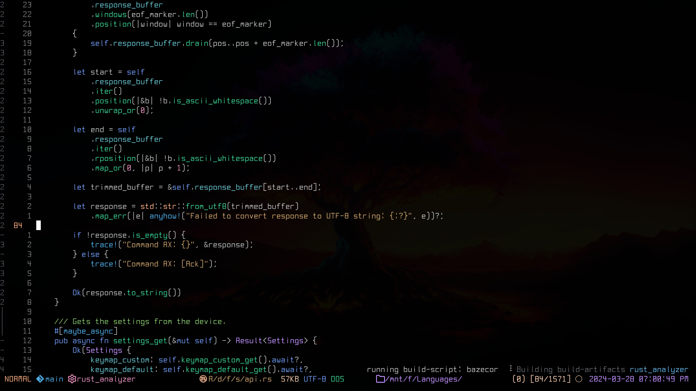

# NeoSpleen

A modern font inspired by [Spleen](https://github.com/fcambus/spleen).

You'll find the fonts under the [releases](https://github.com/mbwilding/NeoSpleen/releases).

## Demonstration



## Showcase

 

## Notes

Recommended font size is 15 (Equivalent to Jetbrains Mono at size 12)

## Install

### Linux

```bash
font_path="~/.local/share/fonts"
mkdir -p ${font_path}
pushd ~/.local/share/fonts
rm NeoSpleen*.ttf
download_base="https://github.com/mbwilding/NeoSpleen/releases/latest/download/NeoSpleen"
wget ${download_base}.ttf
wget ${download_base}-NerdFont.ttf
popd
fc-cache -f
```

### Windows

```powershell
$fontPath = "$env:USERPROFILE\AppData\Local\Microsoft\Windows\Fonts"
New-Item -ItemType Directory -Force -Path $fontPath
Push-Location -Path "$env:USERPROFILE\AppData\Local\Microsoft\Windows\Fonts"
Remove-Item -Path "NeoSpleen*.ttf" -Force
$downloadBase = "https://github.com/mbwilding/NeoSpleen/releases/latest/download/NeoSpleen"
Invoke-WebRequest -Uri "${downloadBase}.ttf" -OutFile "NeoSpleen.ttf"
Invoke-WebRequest -Uri "${downloadBase}-NerdFont.ttf" -OutFile "NeoSpleen-NerdFont.ttf"
Set-Location -Path $currentLocation
```
