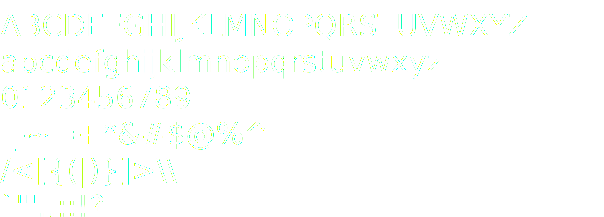
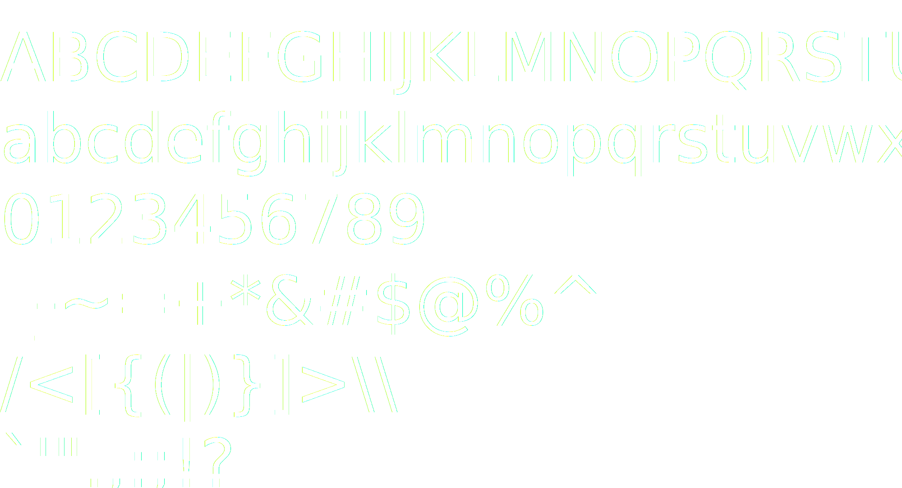
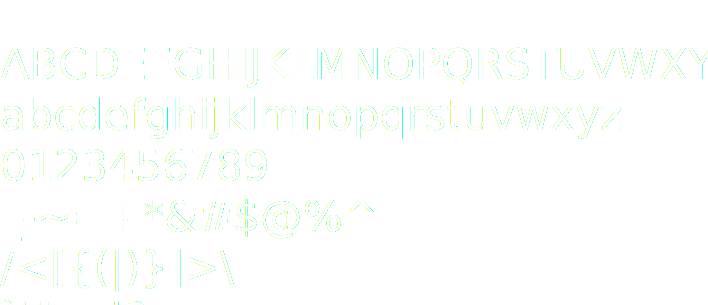

# NeoSpleen

A modern monospaced font inspired by [Spleen](https://github.com/fcambus/spleen).

## Showcase

> Medium and Bold are synthetically generated

### Regular

<picture>
  <source media="(prefers-color-scheme: dark)" srcset="assets/NeoSpleen-Regular-Dark.svg" />
  <source media="(prefers-color-scheme: light)" srcset="assets/NeoSpleen-Regular-Light.svg" />
  
</picture>

### Medium

<picture>
  <source media="(prefers-color-scheme: dark)" srcset="assets/NeoSpleen-Medium-Dark.svg" />
  <source media="(prefers-color-scheme: light)" srcset="assets/NeoSpleen-Medium-Light.svg" />
  
</picture>

### Bold

<picture>
  <source media="(prefers-color-scheme: dark)" srcset="assets/NeoSpleen-Bold-Dark.svg" />
  <source media="(prefers-color-scheme: light)" srcset="assets/NeoSpleen-Bold-Light.svg" />
  
</picture>

## Install

### Mac

```bash
brew tap mbwilding/neospleen
brew install --cask font-neospleen
brew install --cask font-neospleen-nerd-font
```

### Linux

#### Arch (AUR)

- [ttf-neospleen](https://aur.archlinux.org/packages/ttf-neospleen)
- [ttf-neospleen-nerd-font](https://aur.archlinux.org/packages/ttf-neospleen-nerd-font)

```bash
paru -S ttf-neospleen
paru -S ttf-neospleen-nerd-font
```
